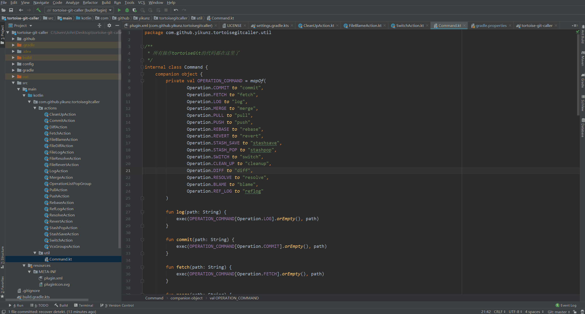
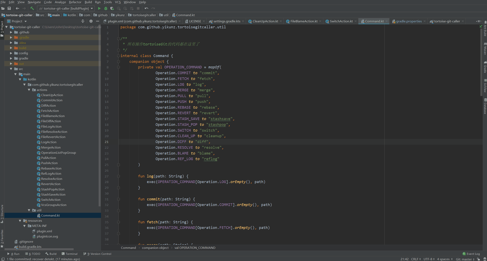

这是一个插件：支持在IDEA中通过快捷键或菜单栏打开本机安装的TortoiseGit界面。

<!-- Plugin description -->
[Github](https://github.com/yikunZ/tortoise-git-caller) | [Plugin](https://plugins.jetbrains.com/plugin/14812-tortoise-git-caller)

# Introduction

This plugin provides for IDEA launching TortoiseGit dialogs.

You can use it by 

- **menu -> VCS -> Tortoise Git Operations Popup**  
- **Project view-> put mouse on a file -> right-click menu -> click 'Tortoise Git File Operations'** 
- **keyboard shortcuts**

Before use this plugin, first you must install the TortoiseGit by you self and make sure the command "TortoiseGitProc" in Windows CMD is usable. This plugin just support to windows user. Because TortoiseGit only support Windows version.

# Default shortcuts

## Global shortcuts:

- (G)it (C)ommit - Ctrl+G, C
- (G)it (F)etch - Ctrl+G, F
- (G)it (L)og - Ctrl+G, L
- (G)it (M)erge - Ctrl+G, M
- (G)it (P)ull - Ctrl+G, P
- (G)it P(u)sh - Ctrl+G, U
- (G)it (R)ebase - Ctrl+G, R
- (G)it Re(v)ert - Ctrl+G, V
- (G)it Stash-P(o)p - Ctrl+G, O
- (G)it Stash-S(a)ve - Ctrl+G, A
- (G)it (S)witch - Ctrl+G, S
- (G)it Clea(n)up - Ctrl+G, N
- (G)it Repository (D)iff - Ctrl+G, D
- (G)it R(e)solve - Ctrl+G, E

## Current file shortcuts:

- (G)it File (L)og - Ctrl+Shift+G, L
- (G)it File R(e)solve - Ctrl+Shift+G, E
- (G)it File Re(v)ert - Ctrl+Shift+G, V
- (G)it File (B)lame - Ctrl+Shift+G, B
- (G)it File (D)iff - Ctrl+Shift+G, D

If you want to customize shortcuts, you can via File -> Settings -> keymap.

## Shortcut conflicts

Since the default shortcuts will make Ctrl+G (Go To Line) inaccessible, you can change them, or just change the one for "Go To Line" to be Ctrl+G, G
<!-- Plugin description end -->

# Demonstrate

Via **menu -> VCS -> Tortoise Git Operations Popup**

Via **project pop dialog -> Tortoise Git File Operations**

Plugin based on the [IntelliJ Platform Plugin Template][template].

[template]: https://github.com/JetBrains/intellij-platform-plugin-template
